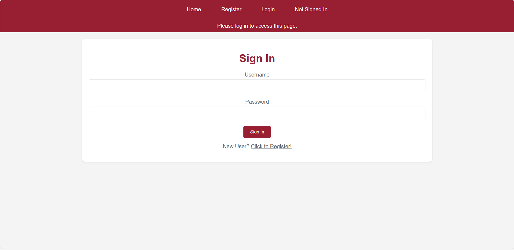
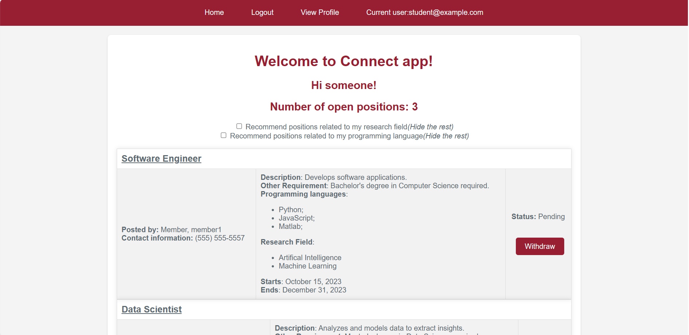

Connect App Starter Code - includes tests



Requirements.txt is updated on Aug 2023

Includes all tests (unittest, pytest, selenium)

---

## Running the application

---

### To run this example:

- Start the application with the following command:
  ```
  python3 app.py
  ```

### To run the tests:

- run the tests for Model (unittest)
  ```
  python -m unittest -v tests/test_models.py
  ```
- run the tests for routes (pytest)
  ```
  python -m pytest -v tests/test_routes.py
  ```
- run the selenium tests
  - Download the Chrome webdriver for your Chrome browser version (https://chromedriver.chromium.org/downloads); extract and copy it under `C:\Webdriver` folder.
  - Run the ConnectApp in a terminal window:
    ```
    python app.py
    ```
  - Run the selenium tests
  ```
      python tests/test_selenium.py
  ```
